# Hi there, I'm Michael 👋

**Ruby & Rails Developer** passionate about building robust web applications, cybersecurity, and contributing to open source.

## 🚀 Featured Projects

- **[lunchmoney gem](https://rubygems.org/gems/lunchmoney)** - Ruby API client library for [LunchMoney](http://lunchmoney.app/)
- **[Userscripts Collection](https://github.com/mmenanno/userscripts)** - Browser automation scripts to enhance web experiences

## 💼 Focus Areas

- **Web Development** - Building scalable Rails applications with modern practices
- **Cybersecurity** - Security-first development and defensive coding practices  
- **API Design** - Creating robust, well-documented APIs
- **Open Source** - Contributing to projects that make a difference

## Languages and Tools

## GitHub Stats & Activity

## ☕ Support My Work

---

💡 **Always learning, always building.** Let's connect and create something amazing together!
